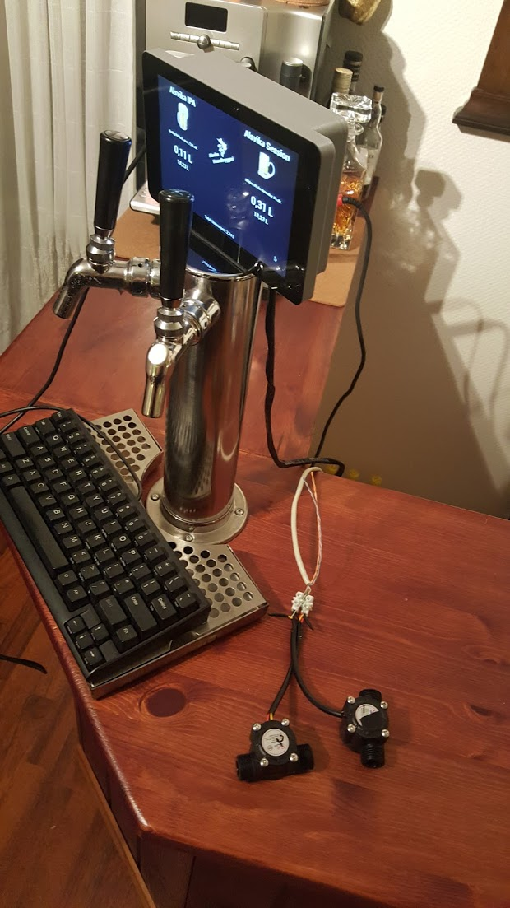

Alsvika Brew Tap Monitor
----

Simple monitor to show what's on the tap and information about the flow, using some ideas from
the Kegomatic-project. 

Uses my internal key/value-store, but should be easy to rewrite for something else. 

The monitor show how much beer is being tapped, how much there's left and the total amount since last reset. 

